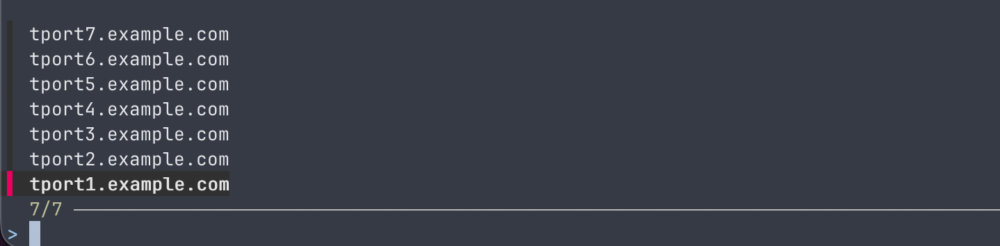

# tshc

[](https://github.com/kuyantus/tshc/actions/workflows/ci.yml)
[](LICENSE)

I built `tshc` because logging in to several Teleport clusters one by one got old. It reads local-login credentials from KeePass, runs `tsh login`, and lets you pick one cluster or sign in to all of them. TOTP can come from KeePass or from an authenticator on your phone.



`tshc` is for Teleport's password-and-OTP login flow. It does not automate SSO or browser-based login.

## What you need

- `tsh` installed (in `PATH`, unless you set `tsh_path`)
- A KeePass `.kdbx` database with a `UserName` and `Password` in each Teleport entry
- Go 1.26.8 or newer if you use `go install` or build manually

[`fzf`](https://github.com/junegunn/fzf) is optional. With it, you get a searchable cluster list. Without it, `tshc` shows a numbered list in the terminal.

## Install

With Homebrew on macOS or Linux:

```bash
brew install kuyantus/tap/tshc
```

The Homebrew formula does not install Teleport: keep using the `tsh` version that works with your clusters. It does not install `fzf` either, since the built-in selector works without it. To update later, run `brew upgrade kuyantus/tap/tshc`.

On macOS, Homebrew directories may be writable by the `admin` group. To use
`fzf` or `tsh` from those directories, add this top-level setting to
`~/.tshc/teleports.yaml` **only if you trust every member of that group**:

```yaml
trusted_executable_groups: [admin]
```

This explicitly allows group write permission on parent directories owned by
you or root. Executable files must still be owned by you or root and must not
be writable by a group or others; directories writable by everyone remain
rejected. No groups are trusted by default. If an automatically discovered
`fzf` fails validation, `tshc` explains why and uses the numbered selector.
An invalid explicit `fzf_path` still produces an error.

If you already have Go 1.26.8 or newer, you can also install with:

```bash
go install github.com/kuyantus/tshc@latest
```

Or build from a checkout of this repository:

```bash
go build -o tshc .
```

## First run

Run `tshc` once. It creates `~/.tshc/teleports.yaml` and stops so you can edit the file before any login is attempted. Your existing config is never replaced.

Here's a small example:

```yaml
keepass_db: /path/to/passwords.kdbx
keepass_password:
  source: keychain

teleports:
  - name: work
    proxy: teleport.example.com
    keepass_entry: Teleport/work
    totp_source: prompt
    tsh_args:
      - --ttl=480
```

Replace the database path, proxy address, and KeePass entry path with your own. `keepass_entry` is relative to the database's root group: use `group/entry`, or just `entry` if it is in the root group. The optional `tsh_args` list is passed to `tsh login`; `--ttl=480` requests 480 minutes (eight hours), subject to your Teleport cluster's limits.

On macOS, save the KeePass master password in Keychain before your next run if you want to avoid entering it each time. See [Using Keychain](#using-keychain) below. On Linux, `tshc` asks for the password in the terminal.

Now run `tshc` again and choose a cluster. Select `[ALL]` to log in to each configured cluster in turn.

## TOTP and other options

Set `totp_source` on each cluster:

- `prompt` asks for a code when `tsh` requests one. Use this for an authenticator on another device.
- `keepass` generates a code from the KeePass entry's `otp` field. That field must contain an `otpauth://totp/...` URI. This is the default if `totp_source` is omitted.

You can also set `login_timeout` (default `5m`), or provide absolute `tsh_path` and `fzf_path` values if the executables are not in `PATH`. The generated [configuration template](teleports.yaml) shows the layout.

For command help and the installed version:

```bash
tshc --help
tshc --version
```

## Using Keychain

With `keepass_password.source: keychain` on macOS, save your KeePass database's master password once:

```bash
tshc keychain set
```

Enter the KeePass master password when prompted in the terminal. It is saved in your default macOS Keychain, not in `teleports.yaml`.

On the next run, macOS shows a Keychain access dialog for `security`, the system tool used by `tshc`. Choose **Allow / Allow Once** to confirm access on each run, or **Always Allow** for automatic access. macOS may also ask for your Keychain password, usually your Mac login password. Selecting `[ALL]` needs only one Keychain read for the whole batch.

If `tshc` cannot read the saved password, it asks for the KeePass master password in the terminal instead.

To stop using Keychain, set `keepass_password.source: prompt` in your config and remove the saved password:

```bash
tshc keychain delete
```

## License

[MIT](LICENSE)
